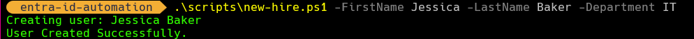
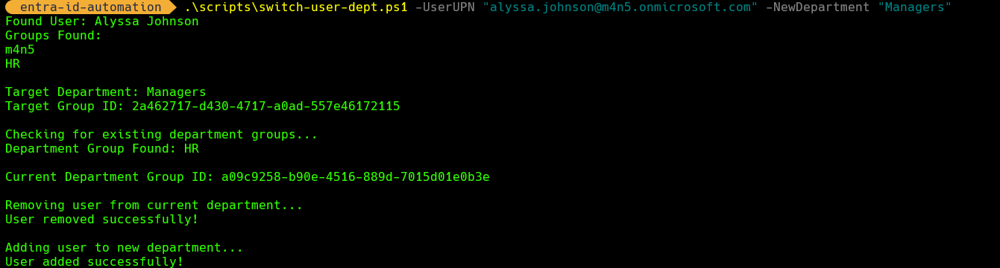
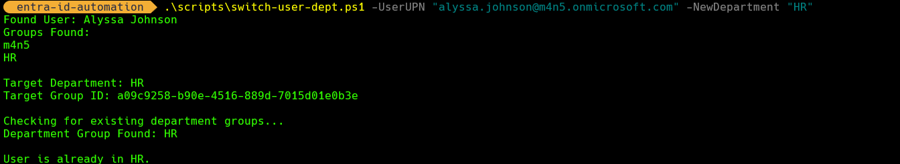
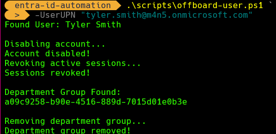
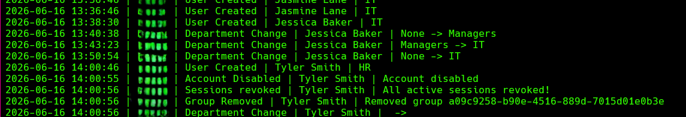

# Entra ID Lifecycle Automation

## Overview

This project automates the identity lifecycle within Microsoft Entra ID using PowerShell 7 and the Microsoft Graph PowerShell SDK. The solution was built to simulate Identity and Access Management (IAM) operations commonly performed by enterprise identity teams, including user onboarding, department-based access management, department transfers, and offboarding. The project demonstrates how Microsoft Graph can be used to automate access provisioning, role changes, and user deprovisioning while maintaining an auditable record of administrative actions.

The project demonstrates practical experience with:

* PowerShell automation
* Microsoft Graph API
* Microsoft Entra ID
* Role-based access through Entra ID group assignments
* Identity lifecycle management
* Audit logging and compliance reporting

---

## Project Summary

Developed a PowerShell and Microsoft Graph automation solution for the full Microsoft Entra ID identity lifecycle, including user onboarding, department-based access provisioning, role changes, offboarding, session revocation, and audit logging. The project demonstrates practical IAM concepts including access management, identity governance, lifecycle automation, and compliance-focused reporting.

## Features

### User Onboarding



Creates new users in Entra ID and assigns department-based access.

* Creates user accounts
* Generates temporary passwords
* Assigns department groups
* Records onboarding actions in audit logs

Supported departments:

* HR
* IT
* Managers
* Contractors

---

### Department Transfers





Automates user access changes when employees move between departments.

* Detects current department membership
* Removes existing department access
* Assigns new department access
* Prevents duplicate assignments
* Validates department input
* Records changes in audit logs

---

### User Offboarding



Automates core offboarding activities.

* Disables user accounts
* Revokes active sign-in sessions
* Removes department-based access
* Records offboarding actions in audit logs

---

## Technologies Used

* PowerShell 7
* Microsoft Graph PowerShell SDK
* Microsoft Entra ID
* Git
* GitHub

---

## Architecture

### New Hire Workflow

Create User
↓
Generate Temporary Password
↓
Assign Department Group
↓
Write Audit Log

---

### Department Change Workflow

Find User
↓
Detect Current Department
↓
Remove Existing Group
↓
Assign New Group
↓
Write Audit Log

---

### Offboarding Workflow

Find User
↓
Disable Account
↓
Revoke Sessions
↓
Remove Department Group
↓
Write Audit Log

---

## Project Structure

```text
entra-id-automation/
│
├── scripts/
│   ├── new-hire.ps1
│   ├── switch-user-dept.ps1
│   └── offboard-user.ps1
│
├── logs/
│   └── audit.log
│
└── README.md
```

## Example Usage

### Create New User

```powershell
.\scripts\new-hire.ps1 `
-FirstName Alyssa `
-LastName Johnson `
-Department HR
```

### Change Department

```powershell
.\scripts\switch-user-dept.ps1 `
-UserUPN "alyssa.johnson@tenant.onmicrosoft.com" `
-NewDepartment Managers
```

### Offboard User

```powershell
.\scripts\offboard-user.ps1 `
-UserUPN "alyssa.johnson@tenant.onmicrosoft.com"
```

## Audit Logging

Administrative actions are logged to:

```text
.\logs\audit.log
```


Example:

```text
2025-06-15 23:08:50 | ****** | Account Disabled | Alyssa Johnson | Account disabled

2025-06-15 23:08:51 | ****** | Sessions Revoked | Alyssa Johnson | All active sessions revoked

2025-06-15 23:35:49 | ****** | Department Change | Alyssa Johnson | HR -> Managers
```

The audit log provides a simple record of administrative actions that can support compliance reviews, access certifications, and troubleshooting.

---

## Lessons Learned

During development, this project provided hands-on experience with:

* Microsoft Graph authentication
* Graph permissions and scopes
* PowerShell objects and properties
* Hashtables and lookup tables
* Group membership management
* Error handling and validation• Microsoft Graph PowerShell SDK administration
* User lifecycle automation design
* Access provisioning and deprovisioning workflows
* Audit trail generation for compliance support
* Audit logging
* Git and GitHub workflows
* Identity lifecycle automation concepts

---

## Future Enhancements

Planned improvements include:

* Automated Microsoft 365 license provisioning and removal
* Bulk onboarding via CSV import
* Role-based access templates
* Manager approval workflows
* Reporting dashboards
* Automated access reviews
* Automated group-based licensing
* Account expiration workflows
* Privileged access assignment automation

---

## Author

Built as a hands-on Identity and Access Management (IAM) learning project focused on Microsoft Entra ID automation, PowerShell, and Microsoft Graph.
